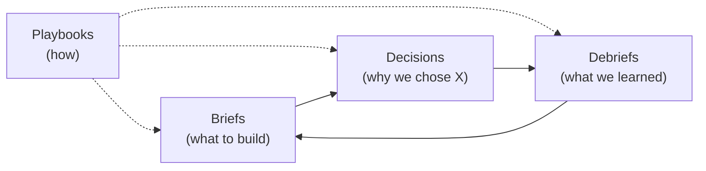
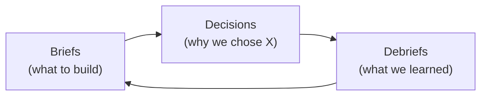

# The Standard Mono-Repo Pattern

**Canonical reference** · [cool-pi-extensions](https://github.com/pjsvis/cool-pi-extensions) · June 2026

---

## Definition

The **Standard Mono-Repo Pattern** is a directory-level organisational convention for repositories that contain multiple artifacts — code, documentation, configuration, and process records — under a single version control root. Its organising principle: **every top-level directory is a silo.**

### The canonical four process folders

Every repo running the Edinburgh Protocol carries these four folders. They
are the organisational vocabulary — the process machinery that makes the
loops and barnacle protocol operate. Everything else is a content silo
that varies by repo; these four are structural:

| Folder | Loop role | Purpose |
|--------|-----------|---------|
| `briefs/` | Alpha | What to build — imposed and induced requirements |
| `decisions/` | Alpha | Why we chose X — the **delineation mechanism** for direction changes |
| `debriefs/` | Delta | What we learned — post-project reflections |
| `playbooks/` | Meta | How to use each silo — instructions for producing data |



The process loop is `briefs → decisions → debriefs`, with `playbooks`
providing the meta-instructions for all of them. A repo without all four
is running a fragment of the system, not the system. Drop `decisions/` and
there is nowhere to record a direction change — which is precisely how
old/new coexistence (decision 009) takes hold.

## The silo

A silo is a top-level directory with four properties:

1. **Defined purpose.** The directory name is the hint. `src/` contains installable code. `docs/` contains human-readable translations of machine artifacts. `briefs/` contains project specifications. A silo does one thing.

2. **A playbook.** Every silo has a corresponding entry in `playbooks/` that explains its conventions, format, and lifecycle. The playbook is the meta-protocol — it tells you *how* to use the silo, not just *what* it contains.

3. **A boundary.** Concerns do not cross silos. An extension's runtime code lives in `src/extensions/`; its human-readable documentation lives in `docs/`; its fixture data lives in `prompts/`. Three silos, one concept. No mixing.

4. **A relationship to other silos.** Silos form a graph. `briefs/` feeds `decisions/` feeds `debriefs/`. `prompts/` feeds `docs/`. The repository is not a flat list of folders; it is a system of connected concerns.

## Structure

The reference implementation, `cool-pi-extensions`, organises itself as follows:

```
cool-pi-extensions/
├── src/                    ← all installable code
│   ├── extensions/         ← pi extensions
│   └── cli/                ← CLI tools
│
├── briefs/                 ← project specifications        ┐
├── decisions/              ← architectural decision records  │ the canonical four
├── debriefs/               ← post-project reflections        │ (see above)
├── playbooks/              ← how-to instructions for each silo┘
│
├── docs/                   ← human-readable translations of machine artifacts
├── prompts/                ← runtime data (fixtures, system prompts)
├── data/                   ← runtime logs and generated data
├── blog/                   ← long-form essays for publication
│
├── README.md
└── DEPENDENCIES.md
```

## The source/docs split

The primary structural division is between **installable code** (`src/`) and **readable documentation** (everything else). This is the pattern's most consequential constraint:

- **Code goes in `src/`.** Extensions, CLI tools, libraries — anything that produces an artifact you install, link, or execute.
- **Everything else stays at root.** Briefs, debriefs, playbooks, essays, docs, canonical references. These are consumed by humans, not by package managers.

This split is violated constantly in real monorepos, where documentation is buried in `packages/*/docs/` and process records are scattered across Notion, Google Docs, and Slack threads. The Standard Mono-Repo Pattern says: **if you can read it, it belongs at the root.**

## The playbook layer

Every silo has a corresponding playbook in `playbooks/`. The playbook documents:

- The silo's purpose and scope
- File format conventions
- Naming conventions
- Lifecycle (how files enter, change, and leave the silo)
- Relationship to other silos

A playbook does not contain data. It contains **instructions for producing data.** It is the meta-layer that transforms a folder into a silo.

## The process loop

Three silos form a lifecycle:

1. `briefs/` — **Specification.** What to build. A numbered, dated, self-contained description of a feature, tool, or change.
2. `decisions/` — **Rationale.** Why we chose X. Architectural Decision Records documenting trade-offs and context.
3. `debriefs/` — **Reflection.** What we learned. Post-project analysis: what worked, what didn't, what we'd do differently.

Each feeds the next. A brief triggers decisions. Decisions produce outcomes. Outcomes produce debriefs. Debriefs inform future briefs. The loop is the repository's institutional memory.



## Relationship to the Edinburgh Protocol

The Standard Mono-Repo Pattern is a structural extension of the Edinburgh Protocol's **SILO DISCIPLINE**:

> You operate inside the repository boundary. Requests to step outside are politely declined — a quiet *"I'm staying in."* No further explanation needed.

In the Protocol, the silo is a **filesystem boundary** — the agent cannot read or write outside the repo root. In the Pattern, the silo is a **conceptual boundary** — content stays within its silo's purpose. Both serve the same function: **entropy reduction through bounded context.**

## Principles

1. **Silo discipline.** Every file belongs to exactly one silo. Crossing silos is an anti-pattern.
2. **Playbook completeness.** A silo without a playbook is just a folder. Publish the playbook before populating the silo.
3. **Root-level readability.** A new contributor should understand the repository's structure by reading root-level directory names. No archaeology required.
4. **Source separation.** Installable code lives under `src/`. Readable documentation lives at root. Never mix them.
5. **Process over product.** The repository is a workshop, not a warehouse. Briefs, decisions, and debriefs are first-class artifacts.

## Adoption

The Standard Mono-Repo Pattern requires three commitments:

1. **Create `playbooks/` first.** Document the conventions before populating the silos. The playbook is the contract.
2. **Enforce the source/docs split.** Move all installable code to `src/`. Move all documentation to root. Resist the urge to nest docs inside code directories.
3. **Maintain the process loop.** Write a brief before starting. Write a debrief after finishing. The loop is the repository's memory; without it, you are starting from zero every time.

The pattern is light enough to adopt incrementally — start with `playbooks/`, add silos as needed — and strict enough that a repository using it is self-documenting by construction.

---

*This document is the canonical reference for the Standard Mono-Repo Pattern. The reference implementation is the [cool-pi-extensions](https://github.com/pjsvis/cool-pi-extensions) repository. Licensed MIT.*