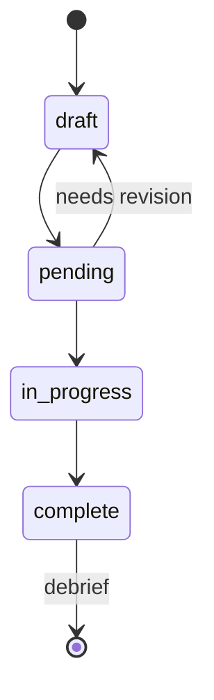

# Playbook: briefs/

## Purpose

Project briefs define the **what** and **why** before any code is written. Each brief is a self-contained specification for a single feature, extension, or tool.

## Format

Filename: `NNN-short-slug.md` (e.g., `001-rewrite-silo.md`, `003-protocol-evals.md`)

```markdown
# brief: Short descriptive title

**Created:** YYYY-MM-DD
**TD:** td-xxxxx (optional)
**Status:** pending | in-progress | complete

## What
One-paragraph summary of the feature.

## Why
Motivation — what problem does this solve?

## How
Implementation approach. High-level, not line-by-line.

## Acceptance criteria
Bullet list of verifiable completion conditions.

## Out of scope
What we explicitly are NOT building (to prevent scope creep).
```

## Conventions

- Assign a sequential number (`001`, `002`, ...) as soon as the brief is created
- Link the corresponding TD issue when one exists
- Update status as work progresses
- Briefs are **not** living documents — they freeze when the project starts. Changes go in the debrief.
- Keep briefs under 2KB. If it's longer, split it into multiple briefs.

## Lifecycle



A complete brief feeds into `debriefs/NNN-slug.md`.
