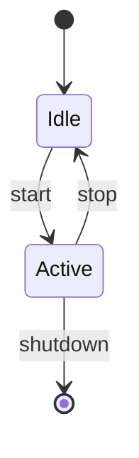

# Playbook: diagrams

## Purpose

How we author and render diagrams in this repo. Two tracks, partitioned by **audience**, not by diagram type. The partition resolves the inherent conflict between mermaid's readable-source/zero-pipeline virtues and Graphviz's layout-quality virtue: each track takes the tool whose strength matches its audience. The *why* is in `decisions/012-diagram-strategy.md`; this file is the *how*.

| Track | Audience | Tool | Layout | Committed artifact |
|---|---|---|---|---|
| **Publication** | Readers of GitHub docs | mermaid DSL in `.md` | dagre (via GitHub's renderer) | the `.md` source itself |
| **Analysis** | Author / agent, transiently | DOT | `dot` (Graphviz) | DOT source; SVG is ephemeral |

## Track 1 — Publication (mermaid-native)

**When:** simple box drawings, state machines, any small graph meant to be *read* in a rendered GitHub document.

**How:** author a fenced ```mermaid block directly in the `.md`. GitHub renders it. No local tooling required.

````md

````

Rules:
- **Keep graphs small.** If dagre's layout starts to look wrong — crossing edges, cramped clusters, unreadable spacing — that's the signal to escalate to Track 2.
- **No committed SVG.** The `.md` source is the artifact.
- **No pipeline.** Edits just work.

## Track 2 — Analysis (DOT, ephemeral SVG)

**When:** large or dense graphs used for *inspection* — understanding structure, finding tangles, the kind of thing the understand-* skills emit. Not meant for readers; meant to be stared at.

**How:** author a `.dot` file, render to SVG locally, inspect, discard the SVG.

```bash
dot -Tsvg path/to/graph.dot -o path/to/graph.svg && open path/to/graph.svg
```

Rules:
- **DOT source is committed.** It is the artifact of record — text, stable, reviewable.
- **SVG is never committed.** It is ephemeral tooling output. Render, look, discard.
- **SVG rendering fidelity doesn't matter** (it varies by installed fonts) — because it is never diffed or reproduced across machines. This is the payoff of the ephemeral rule: Track 2 inherits none of the determinism/font-coupling burden that makes faithful ports hard.
- **A GitHub reader will see raw DOT text** for these diagrams. That is intentional: they are analysis artifacts, not publication.

## Conventions

### Where things live
- **Publication mermaid:** inline in the relevant `.md`.
- **Analysis DOT:** `docs/diagrams/*.dot` (or alongside the analysis it supports). Commit the `.dot`.
- **Ephemeral SVG:** gitignored (see scaffolding below). Pick one of: render next to the `.dot` and gitignore `*.svg` there, or render to a scratch dir like `.diagrams/`. Either way, keep `git status` clean.

### Scaffolding (deferred until first use)

There are no `.dot` files in the repo yet. Per MVAS (Decision 006), the scaffolding below is **not wired** — it lands when the first DOT diagram forces it. Documented here so it is ready.

`.gitignore` entry:
```gitignore
# Track-2 analysis diagrams: SVGs are inspection-only, never committed
docs/diagrams/*.svg
```

`justfile` targets (facade only — implementation in `scripts/`, per the justfile boundary rule):
```make
# Render a DOT file to SVG for local inspection (ephemeral, gitignored)
inspect-dot file:
    @scripts/inspect-dot.sh {{ file }}

# Validate all committed DOT files parse (guard against silent rot)
check-dot:
    @scripts/check-dot.sh
```

`scripts/check-dot.sh` (the one thing worth wiring early once DOT exists — committed DOT has no renderer checking it, unlike mermaid blocks):
```bash
#!/usr/bin/env bash
set -euo pipefail
# Fail if any committed .dot file does not parse.
find . -name '*.dot' -not -path './.git/*' -print0 \
  | xargs -0 -I{} dot -Tsvg {} -o /dev/null
```

Slot `check-dot` into the `check` aggregate so CI catches DOT syntax errors GitHub won't.

## The exception boundary

Someday a DOT diagram will turn out publication-worthy — too good to leave as raw text. The rule:

- **Default:** DOT SVGs are never committed. Re-author the diagram **small in mermaid** for the docs.
- **Deliberate exception:** if a diagram genuinely can't be expressed in mermaid at a readable size, commit *that one* SVG by force-adding it (`git add -f path/to.svg`) with a comment in the `.dot` (or the PR) naming *why* this is an exception. This must be a conscious override, not drift.

Fuzzy "sometimes we commit SVGs" is where entropy accumulates. The default is no; exceptions are named.

## When to escalate (Track 1 → Track 2)

Move a diagram from mermaid to DOT when **any** of these hold:
- The graph is large or dense enough that dagre's layout is visibly wrong (crossings, cramped clusters, unreadable).
- You need layout features dagre lacks — port-level edges, record/HTML labels, rank constraints, edge concentration, ortho splines.
- It's an analysis artifact, not a publication — the audience is you, not a reader.

**Don't escalate preemptively.** Small graphs in mermaid are the default; DOT earns its pipeline cost only when dagre actually fails.

## Dependency surface

- **Track 1:** nothing local. GitHub provides the renderer.
- **Track 2:** `dot` (Graphviz). `brew install graphviz` / `apt install graphviz`. Verify with `just install-deps`.

No sebastian, no `mmdc`, no Chromium, no wasm. That minimalism is the point.

## References

- Decision 012 — the *why* behind this playbook.
- sebastian (evaluated, not adopted): https://github.com/aovestdipaperino/sebastian
- Decision 006 (MVAS — don't build the scaffolding before the input exists)
