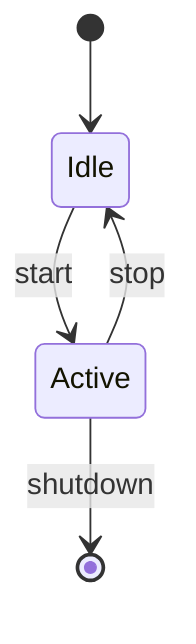
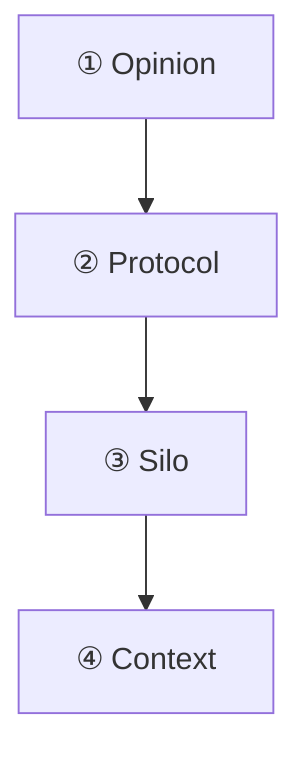

# Playbook: diagrams

## Purpose

How we author and render diagrams in this repo. Two tracks, partitioned by **audience**, not by diagram type. The partition resolves the inherent conflict between mermaid's readable-source/zero-pipeline virtues and Graphviz's layout-quality virtue: each track takes the tool whose strength matches its audience. The *why* is in `decisions/012-diagram-strategy.md`; this file is the *how*.

| Track | Audience | Tool | Layout | Committed artifact |
|---|---|---|---|---|
| **Publication** | Readers of GitHub docs | mermaid DSL in `.md` | dagre (via GitHub's renderer) | the `.md` source itself |
| **Terminal** | Agent / human in the terminal | baked Unicode art via `mermaid-to-md` (external npm CLI) | mermaid-tui engine | the `.md` (art block + `mmd` source) |
| **Analysis** | Author / agent, transiently | DOT | `dot` (Graphviz) | DOT source; SVG is ephemeral |

Publication and Terminal share the **same source** — the mermaid `mmd` block in
the `.md` file. GitHub renders it for web readers; the baked Unicode art
block renders it for terminal readers. Two renderers, one artifact. The
source is the canonical form; the renderers are ports.

## Track 1 — Publication (mermaid-native)

**When:** simple box drawings, state machines, any small graph meant to be
*read* in a rendered GitHub document or in the terminal.

**How:** author a fenced ```mermaid block directly in the `.md`. GitHub
renders it for web readers. Terminal readers get the baked art block
(see Track 1b below).
No local pipeline required for GitHub.

````md

```mermaid
stateDiagram-v2
    [*] --> Idle
    Idle --> Active: start
    Active --> Idle: stop
    Active --> [*]: shutdown
```
````

**Terminal rendering:**

```bash
mermaid-to-md --inject docs/full-stack-overview.md   # (re)bake art from mmd blocks
mermaid-to-md --verify docs/full-stack-overview.md    # drift check (exit 1 if stale)
```

Requires: the external npm CLI `mermaid-to-md` (repo `~/Dev/GitHub/mermaid-to-md`,
symlinked at `~/.local/bin/mermaid-to-md`; Decision 023). Baked art blocks carry
the `<!-- mermaid-to-md:art -->` sentinel — `--verify` ignores unmanaged art.

**Width convention:** bake and verify at `COLUMNS=80` (the terminal default;
more is a band-aid — see the rules below). The width is not recorded in the
artifact, so the convention lives here — verify with
`COLUMNS=80 mermaid-to-md --verify <file>` or art will false-positive as stale.

### Rendering rules (the three laws)

1. **80 columns max, maybe less.** A diagram wider than the terminal is a
   diagram that can't be read where it's committed. Do not widen `COLUMNS` to
   make a too-wide diagram fit — that is benchmaxxing the width, suppressing
   the symptom while the disease (a layout too wide for a terminal) persists.
2. **Vertical by default.** Lay out top-down (`graph TD` / `flowchart TD`)
   unless horizontal is the point (a timeline, a left-to-right pipeline where
   order *is* the message). A simple chain laid out horizontally (`LR`) is a
   bug, not a choice — it forces width for no structural reason.
3. **Too big → refactor, don't widen.** If a diagram still exceeds 80 after
   going vertical, it is too detailed for a flow diagram. Simplify: collapse
   parallel branches that enumerate implementation cases into one node
   ("route to a provider" not four providers); drop debug/edge-case branches
   that belong in code, not in a diagram; split a symmetric two-column
   decision tree into two small per-path diagrams. The diagram shows the
   *shape* of the logic; the code is the source of truth for every branch.

Rules:
- **Keep graphs small.** If dagre's layout starts to look wrong — crossing
  edges, cramped clusters, unreadable spacing — that's the signal to
  escalate to Track 2.
- **No committed SVG.** The `.md` source is the artifact.
- **No pipeline.** Edits just work.
- **Monochrome.** The terminal renderer outputs box-drawing characters
  without colour. This is deliberate — monochrome is legible in any terminal
  theme (light, dark, solarized). Colour is a future enhancement for a
  specific use case, not a default.

### Numbered-box convention (diagram + key list)

For diagrams with more than 3–4 nodes, descriptive labels make boxes wide
and the layout sprawls. Use **numbered nodes** instead, with a key list
below the diagram:

````md

```mermaid
flowchart TD
  G["① Opinion"]
  L1["② Protocol"]
  L2["③ Silo"]
  L3["④ Context"]
  G --> L1 --> L2 --> L3
```

1. **Opinion / proceed** — human decision gate between analysis and action
2. **Protocol** — normalises the model (~200 tokens/session)
3. **Silo process** — normalises the work (~5 min/artefact)
4. **Bounded context** — normalises the cost (~2 turns/boundary)
````

The diagram stays compact. The list carries the detail. The reader's eye
moves between them — the diagram gives the shape, the list gives the
substance. This is the figure-and-caption pattern from print, applied to
terminal-native docs.

**Put a short text token alongside the number** ("① Opinion", not bare
"①"). A bare glyph is a cipher — meaningful only with the key. A
token+number is legible in isolation and still compact. The key then
glosses the token rather than decoding it.

**The renderer emits the key.** `just mermaid` looks for the ordered list
immediately following the mermaid block and prints it after the diagram.
The diagram and key are a coupled pair in the source; the renderer keeps
them coupled in the terminal. No need to scroll up to find the decoder.

When to use:
- **Numbered+token:** complex diagrams (>4 nodes) where descriptive labels
  would make boxes too wide for the terminal. The token keeps each box
  self-explanatory; the key carries the full gloss.
- **Descriptive:** simple diagrams (≤4 nodes) where the label is short
  enough to be self-explanatory. No key needed.

The tradeoff: numbered boxes are less self-explanatory in isolation. The
text-token convention narrows that gap — the number gives the order, the
token gives the hook, the key gives the detail.

## Track 2 — Analysis (DOT, ephemeral SVG)

**When:** large or dense graphs used for *inspection* — understanding structure, finding tangles, the kind of thing the understand-* skills emit. Not meant for readers; meant to be stared at.

**How:** author a `.dot` file, render to SVG locally, inspect, discard the SVG.

```bash
dot -Tsvg path/to/graph.dot -o path/to/graph.svg && open path/to/graph.svg
```

Rules:
- **DOT source is committed.** It is the artifact of record — text, stable, reviewable.
- **SVG is never committed.** It is ephemeral tooling output. Render, look, discard.
- **SVG rendering fidelity doesn't matter** (it varies by installed fonts) — because it is never diffed or reproduced across machines. This is the payoff of the ephemeral rule: Track 2 inherits none of the determinism/font-coupling burden that makes faithful ports hard.
- **A GitHub reader will see raw DOT text** for these diagrams. That is intentional: they are analysis artifacts, not publication.

## Conventions

### Where things live
- **Publication mermaid:** inline in the relevant `.md`.
- **Analysis DOT:** `docs/diagrams/*.dot` (or alongside the analysis it supports). Commit the `.dot`.
- **Ephemeral SVG:** gitignored (see scaffolding below). Pick one of: render next to the `.dot` and gitignore `*.svg` there, or render to a scratch dir like `.diagrams/`. Either way, keep `git status` clean.

### Scaffolding (deferred until first use)

There are no `.dot` files in the repo yet. Per MVAS (Decision 006), the scaffolding below is **not wired** — it lands when the first DOT diagram forces it. Documented here so it is ready.

`.gitignore` entry:
```gitignore
# Track-2 analysis diagrams: SVGs are inspection-only, never committed
docs/diagrams/*.svg
```

Render and validate DOT with graphviz directly — no justfile recipe is wired (DOT is rare here; the `inspect-dot`/`check-dot` recipes were proposed but never built):

```bash
# Render a DOT file to SVG for local inspection (ephemeral, gitignored)
dot -Tsvg file.dot -o /tmp/file.svg

# Validate all committed DOT files parse (guard against silent rot —
# committed DOT has no renderer checking it, unlike mermaid blocks)
find . -name '*.dot' -not -path './.git/*' -print0 \
  | xargs -0 -I{} dot -Tsvg {} -o /dev/null
```

Wire the validation into a script invoked by `just check` so CI catches DOT syntax errors GitHub won't.

## The exception boundary

Someday a DOT diagram will turn out publication-worthy — too good to leave as raw text. The rule:

- **Default:** DOT SVGs are never committed. Re-author the diagram **small in mermaid** for the docs.
- **Deliberate exception:** if a diagram genuinely can't be expressed in mermaid at a readable size, commit *that one* SVG by force-adding it (`git add -f path/to.svg`) with a comment in the `.dot` (or the PR) naming *why* this is an exception. This must be a conscious override, not drift.

Fuzzy "sometimes we commit SVGs" is where entropy accumulates. The default is no; exceptions are named.

## When to escalate (Track 1 → Track 2)

Move a diagram from mermaid to DOT when **any** of these hold:
- The graph is large or dense enough that dagre's layout is visibly wrong (crossings, cramped clusters, unreadable).
- You need layout features dagre lacks — port-level edges, record/HTML labels, rank constraints, edge concentration, ortho splines.
- It's an analysis artifact, not a publication — the audience is you, not a reader.

**Don't escalate preemptively.** Small graphs in mermaid are the default; DOT earns its pipeline cost only when dagre actually fails.

## Dependency surface

- **Track 1 (GitHub):** nothing local. GitHub provides the renderer.
- **Track 1 (Terminal):** external npm CLI `mermaid-to-md`
  (`~/Dev/GitHub/mermaid-to-md`, symlinked on PATH; Decision 023). No
  in-repo binary; committed art needs no renderer at view time.
- **Track 2:** `dot` (Graphviz). `brew install graphviz` / `apt install
  graphviz`. Verify with `just install-deps`.

No sebastian, no `mmdc`, no Chromium, no wasm. That minimalism is the point.

## References

- Decision 012 — the *why* behind this playbook.
- Decision 021 — the eval consolidation that produced the session-newup
  discipline (the terminal renderer was built under the same discipline).
- Decision 023 — the mermaid spinoff: this repo consumes the external CLI.
- `briefs/2026-07-23-brief-mermaid-diagrams-for-docs.md` — this repo's
  diagram-work record (the spun-off tooling briefs moved with the spinoff).
- sebastian (evaluated, not adopted): https://github.com/aovestdipaperino/sebastian
- Decision 006 (MVAS — don't build the scaffolding before the input exists)
